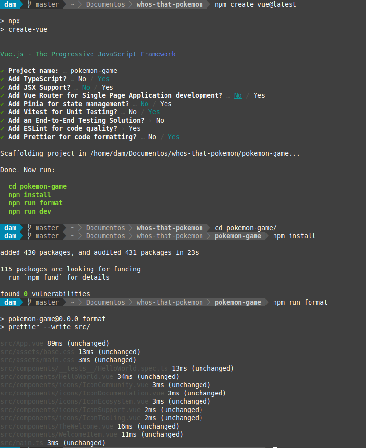

# Who's that Pokémon?

## Índice
- [Descripción](#index01)
- [Reto 1](#index02)

### Descripción 

Repositorio dedicado al seguimiento del desarrollo de la aplicación Vue basado en el juego del anime de Pokémon "¿Cuál es ese Pokémon?". Dicho seguimiento se hará con retos.

### Reto 1: Iniciando Proyecto Pokemon Game 

