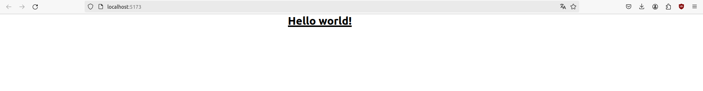

# Who's that Pokémon?

## Índice
- [Descripción](#index01)
- [Reto 1](#index02)

### Descripción 

Repositorio dedicado al seguimiento del desarrollo de la aplicación Vue basado en el juego del anime de Pokémon "¿Cuál es ese Pokémon?". Dicho seguimiento se hará con retos.

### Reto 1: Iniciando Proyecto Pokemon Game 

Hablemos un poco sobre algunas de las opciones que se han elegido. El proyecto se hará en Typescript. Las demás opciones son:

- Vue Router: Utilizado para crear SPA (Single Page Application), es decir, aplicaciones con varias rutas pero solo una página. El equivalente en React es BrowserRouter. Nuestra aplicación solo tendrá una ruta, por lo tanto no es necesario.
- Pinia: Librería para Vue que permite compartir un estado para todos los componentes, similar al contexto en React. Es una forma de pasar datos a componentes que no interactúan directamente entre sí
- Vitest: Librería de testing para Vue
- ESLint: Muestra los errores y warnings durante el desarrollo.
- Prettier: Herramienta de formateo utilizado para que se vea, como su nombre indica, prettier.

Ejecutemos ahora los comandos que nos indica Vue en la imagen anterior

Comprobamos que se ha lanzado

Este proyecto seguirá la estructura Vue de Composition API, y la arquitectura estará basada en "screaming architecture".

Composition API es un método de hacer componentes en Vue que ofrece una forma más sencilla de programar, simplemente agregando "setup" al script e indicando las variables y funciones pertinentes. Se diferencia de Option API en cuanto a la sencillez y legibilidad del código, puesto que con Option API habría que inicializar el componente con data() y poner propiedades y métodos por separado.

Screaming architecture es una forma de estructurar el proyecto que fomenta la claridad. La estructura de carpetas debe estar hecha de una forma que cualquier persona pueda saber qué hace cada parte a simple vista.

Dejamos el fichero App.vue con la estructura básica, indicándole que usaremos TypeScript pasándole el atributo lang. Observamos que directamente nos da el setup de Composition API. Borramos base.css y logo.svg puesto que no los usaremos, y renombramos main.css a styles.css, cambiando el import en main.ts:

Y al ejecutar npm run dev, comprobamos que funciona:

Finalmente, vamos a aplicarle Tailwind CSS:

Y con esto ya completamos el reto 1!

