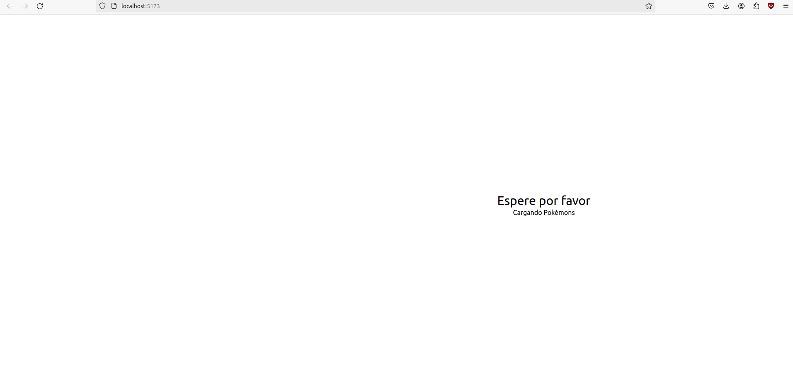

<div align='justify'>

# Who's that Pokémon?


## Índice
- [Descripción](#index01)
- [Reto 1](#index02)
- [Reto 2](#index03)
- [Reto 3](#index04)
- [Reto 4](#index05)

### Descripción <a name="index01"></a>

Repositorio dedicado al seguimiento del desarrollo de la aplicación Vue basado en el juego del anime de Pokémon "¿Cuál es ese Pokémon?". Dicho seguimiento se hará con retos.

### Reto 1: Iniciando Proyecto Pokemon Game <a name="index02"></a>


Hablemos un poco sobre algunas de las opciones que se han elegido. El proyecto se hará en Typescript. Las demás opciones son:

- Vue Router: Utilizado para crear SPA (Single Page Application), es decir, aplicaciones con varias rutas pero solo una página. El equivalente en React es BrowserRouter. Nuestra aplicación solo tendrá una ruta, por lo tanto no es necesario.
- Pinia: Librería para Vue que permite compartir un estado para todos los componentes, similar al contexto en React. Es una forma de pasar datos a componentes que no interactúan directamente entre sí
- Vitest: Librería de testing para Vue
- ESLint: Muestra los errores y warnings durante el desarrollo.
- Prettier: Herramienta de formateo utilizado para que se vea, como su nombre indica, prettier.

Ejecutemos ahora los comandos que nos indica Vue en la imagen anterior


Comprobamos que se ha lanzado


Este proyecto seguirá la estructura Vue de Composition API, y la arquitectura estará basada en "screaming architecture".

Composition API es un método de hacer componentes en Vue que ofrece una forma más sencilla de programar, simplemente agregando "setup" al script e indicando las variables y funciones pertinentes. Se diferencia de Option API en cuanto a la sencillez y legibilidad del código, puesto que con Option API habría que inicializar el componente con data() y poner propiedades y métodos por separado.

Screaming architecture es una forma de estructurar el proyecto que fomenta la claridad. La estructura de carpetas debe estar hecha de una forma que cualquier persona pueda saber qué hace cada parte a simple vista.


Dejamos el fichero App.vue con la estructura básica, indicándole que usaremos TypeScript pasándole el atributo lang. Observamos que directamente nos da el setup de Composition API. Borramos base.css y logo.svg puesto que no los usaremos, y renombramos main.css a styles.css, cambiando el import en main.ts:


Y al ejecutar npm run dev, comprobamos que funciona:


Finalmente, vamos a aplicarle Tailwind CSS:


Y con esto ya completamos el reto 1!

### Reto 2: Estructura de la aplicación <a name="index03"></a>

Ahora que lo tenemos inicializado, vamos a estructurar nuestro proyecto para seguir la arquitectura screaming architecture que mencionamos anteriormente. Borramos la carpeta components y creamos en su lugar modules, y dentro de ella pokemon.

A su vez, creamos una carpeta composables. Los composables son el equivalente a los hooks de react, nos permiten reutilizar lógica que normalmente necesitaríamos escribir en cada componente. De manera estándar, llamamos al fichero algo significativo como "mouse" y dentro crearíamos una función "useMouse".

Por último, recreamos components y agregamos una carpeta views. La estructura nos quedaría así:


Ahora en views generamos el archivo PokemonGame.vue. Gracias a nuestra estructura screaming architecture, tenemos claro que tendrá lógica relazionada con la visualización de nuestra aplicación. Ahora, con la extensión de Vue VScode Snippets escribimos en el fichero:

```vue
vbase-3-ts-setup
```

Y nos genera la estructura básica de un componente usando Composition API y typescript.


Ahora dividimos la estructura de PokemonGame en secciones. Primero una sección que indique al usuario que se están cargando los Pokémons:


Las clases de tailwind añadidas básicamente ayudan a centrar y el texto y que la sección ocupe la pantalla, y animate-pulse realiza una animación de transparencia y opacidad constante. Ahora modificamos App.vue para llamar al componente.


Ahora vemos el resultado:



Si quisiéramos ocultarlo podríamos hacerlo con la directiva v-show sobre la etiqueta section, poniendo su valor a false:

```html
<section v-show="false" class="flex flex-col justify-center items-center w-screen h-screen">
    <h1 class="text-3xl">Espere por favor</h1>
    <h3 class="animate-pulse">Cargando Pokémons</h3>
</section>
```

Ahora otra sección con el mensaje de "¿Cuál es ese Pokémon?":

```html
  <section class="flex flex-col justify-center items-center w-screen h-screen">
    <h1>¿Cuál es ese Pokémon?</h1>
    <!--PokemonPicture-->
    <!--PokemonOptions-->
  </section>
```

Los comentarios de PokemonPicture y PokemonOptions indican donde irán dichos componentes. Como su nombre indica, PokémonPicture es el componente que muestra la imagen del Pokémon, cogiéndola de la API. PokemonOptions se encargará de mostrar los botones con las elecciones, consultando con la API para conseguir tres Pokémon aleatorios y el correcto.

Con esto hemos acabado el segundo reto.

### Reto 3: Creando el esqueleto de Pokémon Game <a name="index04"></a>

Ahora que hemos dado estructura a nuestro proyecto, podemos empezar a generar un pequeño esqueleto de lo que acabará siendo nuestra aplicación. Aún no vamos a conectar con la API, así que cogeremos una imagen de Volcarona para este ejemplo.


Esto es un buen comienzo, pero si vemos la imagen del Pokémon tal cual el juego pierde su gracia. Vamos a usar tailwind para ponerla en negro y darle un tamaño uniforme de 200 pixeles, quedando el código tal que así:

```html
<template>

  

</template>

<script setup lang="ts">
  import { ref } from 'vue';

  const imgUrl = ref('https://www.pokemon.com/static-assets/content-assets/cms2/img/pokedex/full/637.png');

</script>

<style scoped>

</style>
```


Ahora que no sé qué Pokémon es, pasemos al componente PokemonOptions. Para este reto solamente vamos a simular las opciones.


```html
<template>
  <div v-for="item in options">
    <div>Option {{ item }}</div>
  </div>
</template>

<script setup lang="ts">
  import { ref } from 'vue';

  const options = ref([1,2,3,4]);
</script>

<style scoped>

</style>
```

Las opciones se ven un poco aburridas. Vamos a convertirlas en botones con las siguientes clases tailwind:

```html
<button class="bg-purple-600 hover:bg-purple-700 mb-2 p-2 w-[150px] text-white rounded-full">Option {{ item }}</button>
```

En lugar de poner el class directamente sobre el botón, podemos limpiar bastante nuestro código HTML con @apply en el apartado de estilos:

```html
<template>
  <div v-for="item in options">
    <button>Option {{ item }}</button>
  </div>
</template>

<script setup lang="ts">
  import { ref } from 'vue';

  const options = ref([1,2,3,4]);
</script>

<style scoped>

  button {
    @apply bg-purple-600 hover:bg-purple-700 mb-2 p-2 w-[150px] text-white rounded-full
  }

</style>


```


Finalmente, para poner nuestro color de fondo a #f1f1f1, vamos a nuestro styles.css y agregamos:

```css
html,
body {
  background-color: #f1f1f1;
}
```


Reto 3 completado!

### Reto 4: Conectar con la API usando Axios <a name="index05"></a>

Por fin vamos a utilizar la PokeApi!

Antes de hacer nada, creamos un archivo en assets llamado "animations.css" con el siguiente código:

```css
.fade-in {
    animation: fadeIn 0.3s;
    -webkit-animation: fadeIn 0.3s;
    -moz-animation: fadeIn 0.3s;
    -o-animation: fadeIn 0.3s;
    -ms-animation: fadeIn 0.3s;
  }
  @keyframes fadeIn {
    0% {opacity:0;}
    100% {opacity:1;}
  }
  
  @-moz-keyframes fadeIn {
    0% {opacity:0;}
    100% {opacity:1;}
  }
  
  @-webkit-keyframes fadeIn {
    0% {opacity:0;}
    100% {opacity:1;}
  }
  
  @-o-keyframes fadeIn {
    0% {opacity:0;}
    100% {opacity:1;}
  }
  
  @-ms-keyframes fadeIn {
    0% {opacity:0;}
    100% {opacity:1;}
  }
```

Se trata de una simple animación que se verá cuando cargue el Pokémon. Lo siguiente será crear nuestro primer composable: usePokemonGame. También crearemos un enum con los tres estados de nuestro juego, el cual se encontrará en la carpeta interfaces en pokemon. Cabe mencionar que no es una interfaz como tal.

Como ya se ha mencionado, el juego tendrá tres estados: 

```ts
export enum GameStatus {
  Playing = 'playing',
  Won = 'won',
  Lost = 'lost',
}
```

En la misma carpeta nos hacemos un index.ts que nos servirá de archivo de barril, es decir, un archivo donde podemos exportar varios archivos y hacer solo un import de varios ficheros con un solo path, quedando el código más limpio. 

```ts
import { GameStatus } from "@/modules/pokemon/interfaces";
import { ref } from "vue";

export function usePokemonGame() {
  const gameStatus = ref<GameStatus>(GameStatus.Playing);

  return {
    gameStatus,
  }
}
```

Ahora creamos la carpeta api dentro de la de pokemon y un archivo pokemonApi.ts para hacer las llamadas pertinentes a la api mediante Axios, una librería de javascript que ofrece más comodidad que un simple fetch a la hora de hacer peticiones HTTP, ya que axios nos transforma automáticamente los datos de la respuesta parseada en un json. Lo hemos usado antes en React y React-Native.

Podríamos limitarnos a los primeros 151 Pokémon, pero me da que esa silueta de antes no está entre ellos, así que vamos a limitarlo a la quinta generación. Me da la sensación de que ahí encontraré mi respuesta. ¿Cuál es ese Pokémon? Para limitar los pokémon que nos escupe la api, utilizamos el siguiente enlace= https://pokeapi.co/api/v2/pokemon?offset=493&limit=156. Este enlace nos devuelve los pokémon de la quinta generación.

```ts
import axios from "axios";

const pokemonApi = {
  get: get
}
async function get(limiter: string): Promise<any> {
  try {
    const response = await axios.get('https://pokeapi.co/api/v2/pokemon' + limiter);
    return response;
  } catch (error) {
    console.error(error);
  }
}

export default pokemonApi;

```

Entonces lo usamos en usePokemonGame:

```ts
import pokemonApi from "@/modules/pokemon/api/pokemonApi";
import { GameStatus } from "@/modules/pokemon/interfaces";
import { onMounted, ref } from "vue";

export function usePokemonGame() {
  const gameStatus = ref<GameStatus>(GameStatus.Playing);

  const getPokemon = async () => {
    const response = await pokemonApi.get('?offset=493&limit=156');
    console.log(response.data)
  }

  onMounted(() => {
    getPokemon();
  })

  return {
    gameStatus,
  }
}
```

Vamos a usarlo en PokemonGame.vue para comprobar que funciona.

```html
<script setup lang="ts">
import PokemonOptions from '@/components/PokemonOptions.vue';
import PokemonPicture from '@/components/PokemonPicture.vue';
import { usePokemonGame } from '@/composables/usePokemonGame';

const { gameStatus } = usePokemonGame();
</script>
```


Esto es bueno para nosotros, pero esta lista nos está dando datos que no queremos. Solo nos interesan la ID y el nombre, así que vamos a hacernos un tipado estricto en el archivo pokemon-list.response.ts que crearemos en la carpeta de interfaces. Usaremos json to ts para generar el type:

```ts
interface PokemonListResponse {
  count: number;
  next: string;
  previous: string;
  results: PokeInfo[];
}

interface PokeInfo {
  name: string;
  url: string;
}
```

Ahora nos aseguramos de usar el tipo en pokemonApi y usePokemonGame:

pokemonApi:
```ts
import axios from "axios";

const pokemonApi = {
  get: get
}
async function get<T>(limiter: string): Promise<any> {
  try {
    const response: T = await axios.get('https://pokeapi.co/api/v2/pokemon' + limiter);
    return response;
  } catch (error) {
    console.error(error);
  }
}

export default pokemonApi;
```

usePokemonGame:
```ts
import pokemonApi from "@/modules/pokemon/api/pokemonApi";
import { GameStatus } from "@/modules/pokemon/interfaces";
import { onMounted, ref } from "vue";

export function usePokemonGame() {
  const gameStatus = ref<GameStatus>(GameStatus.Playing);

  const getPokemon = async () => {
    const response = await pokemonApi.get<PokemonListResponse>('?offset=493&limit=156');
    console.log(response.data.results)
  }

  onMounted(() => {
    getPokemon();
  })

  return {
    gameStatus,
  }
}
```


¿Creen que la silueta de antes es uno de esos Pokémon de la imagen? Si tan solo supiera.

Reto 4 completado!


</div>